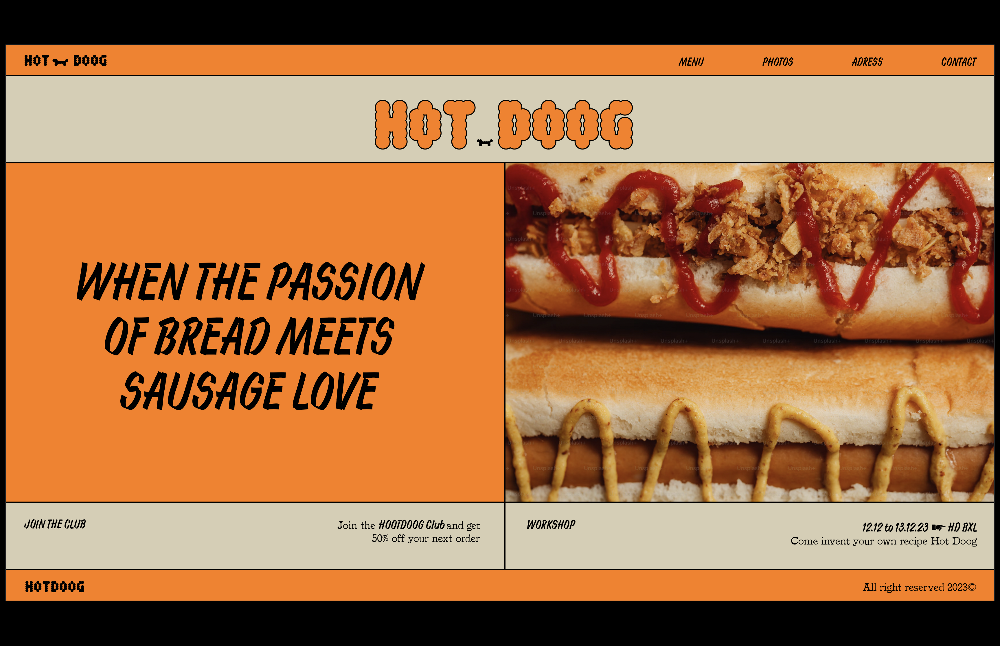
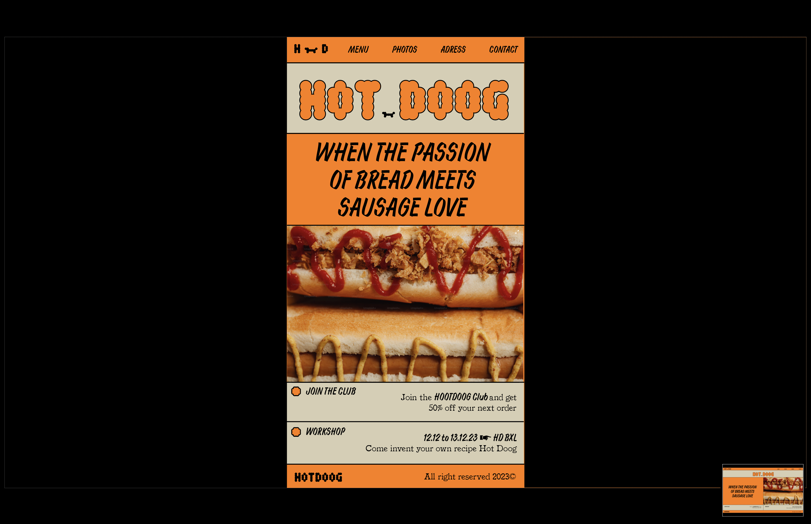
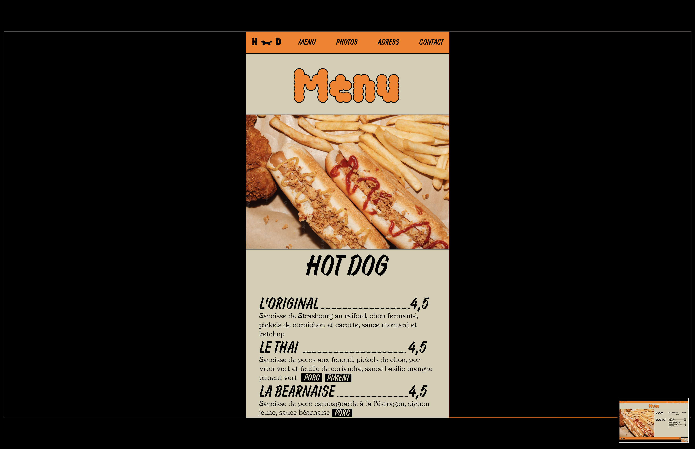
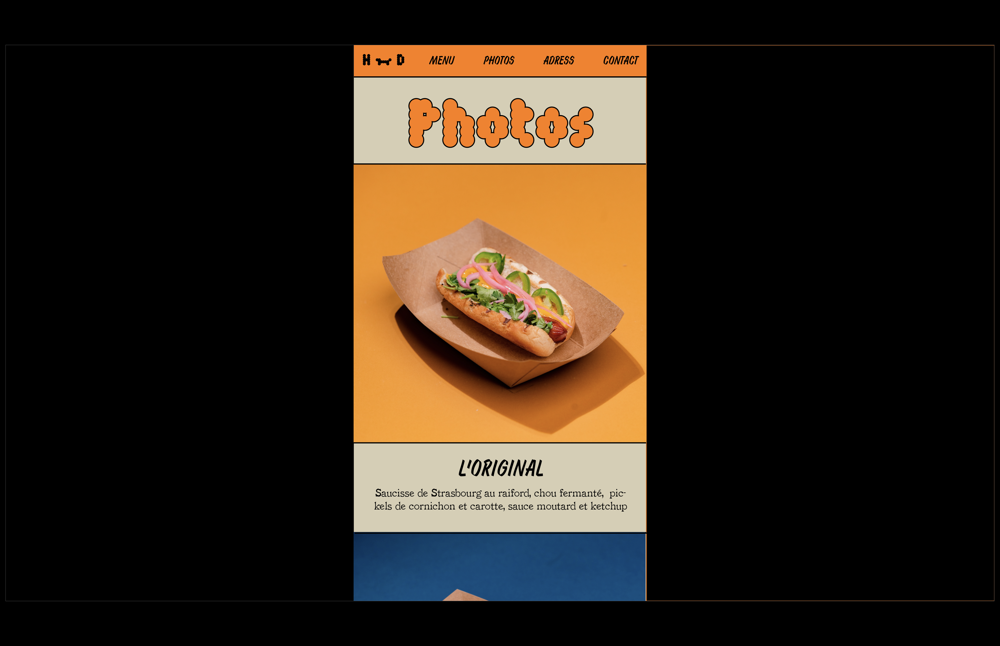
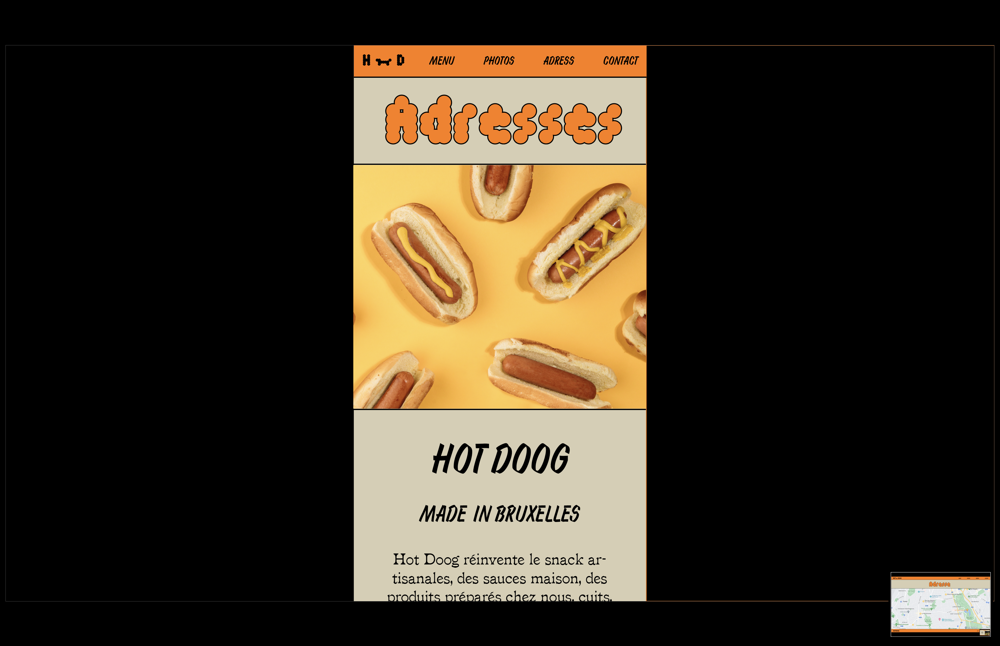
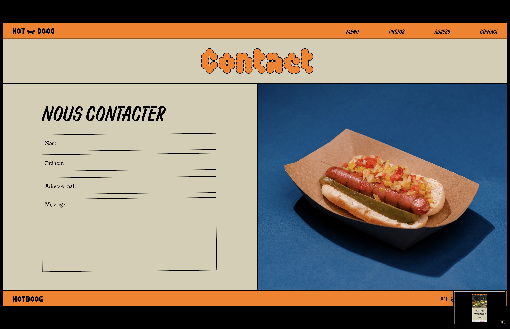

# 🌭 HOT DOOG

## 🔗 LIEN PROJET

[https://evalambert.github.io/hot-doog/](https://evalambert.github.io/hot-doog/ "lien projet restaurant")

## 📌 FICHE ID.PROJET

- **Contexte :** Formation "Junior Developer" BeCode
- **Type :** Challenge
- **Durée :** 4 jours
- **Deadline :** 09/10/23 - 09:00
- **Challenge en équipe :** solo

## 🎯 OBJECTIFS

- Améliorer le positionnement d'élement avec Bootstrap

## 👉 CONSIGNES

- Créer le site web d'un restaurant fictive franchisé
- Mise en page responsive mobil-first
- Architecture du site > 5 pages :
  - Page acceuil
  - Page menu
  - Page photos
  - Page restaurant
  - Page contact

## 🌐 TECHNO & LANGUAGES UTILISÉS

- Html / Css
- Bootstrap
- Node.js
- Npm
- Vite.js
- Sass

## ⏰ ÉTAT D'AVANCEMENT

Terminé 😝

## 👀 MAQUETTE

### DESKTOP & MOBILE

- Page acceuil
  
  

- Page menu
  
  
- Page photos
  
  

- Page restaurant
  
  

- Page contact
  
  

## 📸 CRÉDITS PHOTO

- Unsplash
